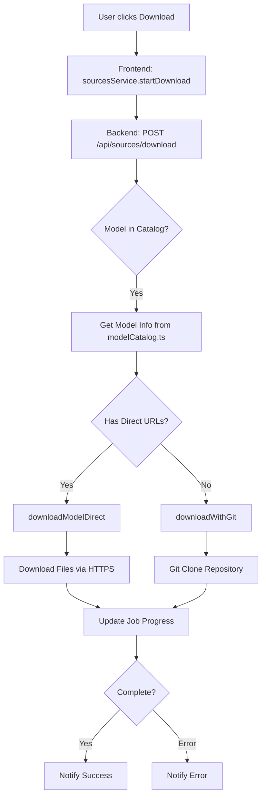
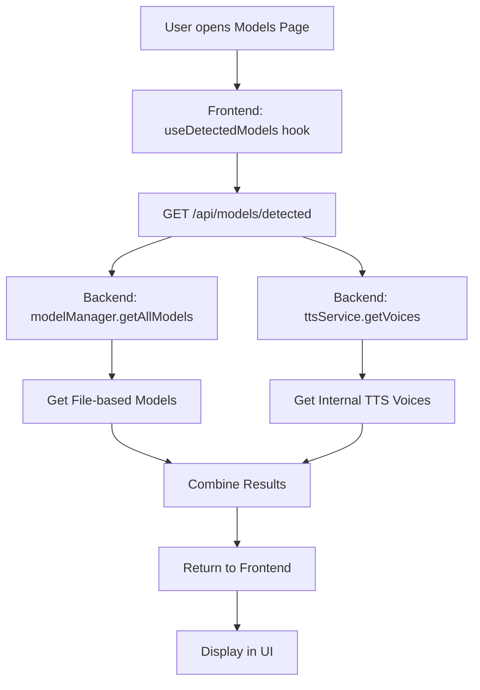

# Analysis: Alt Foil Folders, API Cross-Origin, and Data Sources/Models

**Generated on:** 2025-10-13  
**Branch:** cursor/analyze-alt-foil-folders-and-troubleshoot-api-d3f1

---

## Executive Summary

This document provides a comprehensive analysis of:
1. **Alternative Data Source Folders** ("alt foil folders")
2. **API Cross-Origin (CORS) Configuration**
3. **Model and Dataset Management System**
4. **Troubleshooting Guide for Common Issues**

---

## 1. Architecture Overview

### System Components

```
┌─────────────────────────────────────────────────────────┐
│                     Frontend (React)                     │
│  - DataSourcesPage (manages external sources)           │
│  - ModelsDatasetsPage (views local models/datasets)     │
│  - DownloadCenterPage (downloads from catalog)          │
│  Port: 3000                                             │
└────────────────────┬────────────────────────────────────┘
                     │ HTTP/REST API (CORS enabled)
┌────────────────────┴────────────────────────────────────┐
│                Backend (Node.js/Express)                 │
│  - /api/sources/* (catalog & downloads)                 │
│  - /api/models/* (model management)                     │
│  - /api/datasets/* (dataset management)                 │
│  Port: 3001                                             │
└────────────────────┬────────────────────────────────────┘
                     │
┌────────────────────┴────────────────────────────────────┐
│            Data Storage & External Sources              │
│  - HuggingFace repositories                             │
│  - Local model files (models/)                          │
│  - Local datasets (data/, datasets/)                    │
│  - Download cache (downloads/)                          │
└─────────────────────────────────────────────────────────┘
```

---

## 2. Data Source Management ("Alt Foil Folders")

### 2.1 Data Source Types

The application supports **5 types of data sources**:

| Type | Description | Icon | Status |
|------|-------------|------|--------|
| **github** | GitHub repositories for code/docs extraction | GitHub | 🟡 Partial |
| **gdrive** | Google Drive file access | HardDrive | 🟡 Partial |
| **web** | Web scraping/crawling | Globe | 🟡 Partial |
| **huggingface** | HuggingFace datasets | Database | ✅ Implemented |
| **upload** | Direct file upload | Upload | ✅ Implemented |

**Files involved:**
- Frontend: `client/src/pages/DataSourcesPage.tsx`
- Backend: `BACKEND/src/routes/sources.ts`
- Service: `BACKEND/src/services/downloads.ts`

### 2.2 Model Catalog System

The **Model Catalog** (`BACKEND/src/config/modelCatalog.ts`) contains pre-configured Persian language models:

#### TTS Models (Text-to-Speech)
1. **Kamtera/persian-tts-male-vits** (~50 MB)
2. **Kamtera/persian-tts-female-vits** (~50 MB)

#### Language Models
1. **HooshvareLab/bert-fa-base-uncased** (~440 MB)
2. **persiannlp/mt5-small-parsinlu-squad-reading-comprehension** (~300 MB)

#### Datasets
1. **persiannlp/parsinlu_reading_comprehension** (~10 MB)
2. **hezarai/common-voice-13-fa** (~2 GB)
3. **HooshvareLab/pn_summary** (~50 MB)
4. **persiannlp/parsinlu_translation_fa_en** (~15 MB)

### 2.3 Download System

**Architecture:**

```typescript
interface DownloadJob {
  id: string;
  kind: 'model' | 'tts' | 'dataset';
  repoId: string;
  repoType: 'model' | 'dataset';
  dest: string;
  status: 'pending' | 'downloading' | 'completed' | 'error';
  progress: number; // 0-100
  bytesDownloaded?: number;
  bytesTotal?: number;
  speed?: number;
  currentFile?: string;
  completedFiles: string[];
}
```

**Download Methods:**
1. **Direct HTTP Download** (Primary) - Downloads individual files via HTTPS
2. **Git Clone** (Fallback) - Clones entire HuggingFace repository

**Storage Locations:**
- Models: `models/{type}/{name}/`
- Datasets: `datasets/{type}/{name}/`
- Download logs: `logs/downloads/{jobId}.json`

---

## 3. API Endpoints Reference

### 3.1 Sources/Catalog API (`/api/sources/*`)

| Method | Endpoint | Description | Auth |
|--------|----------|-------------|------|
| GET | `/api/sources/catalog` | Get all models from catalog | ✅ |
| GET | `/api/sources/catalog/:id` | Get specific model | ✅ |
| GET | `/api/sources/catalog/type/:type` | Get by type (model/tts/dataset) | ✅ |
| GET | `/api/sources/catalog/search?q=query` | Search catalog | ✅ |
| POST | `/api/sources/download` | Start download | ✅ |
| GET | `/api/sources/downloads` | Get all downloads | ✅ |
| GET | `/api/sources/download/:jobId` | Get download status | ✅ |
| DELETE | `/api/sources/download/:jobId` | Cancel download | ✅ |
| GET | `/api/sources/models/available` | Legacy: get models | ✅ |
| GET | `/api/sources/datasets/available` | Legacy: get datasets | ✅ |
| GET | `/api/sources/installed` | Get installed models/datasets | ✅ |

### 3.2 Models API (`/api/models/*`)

| Method | Endpoint | Description | Auth |
|--------|----------|-------------|------|
| GET | `/api/models` | Get all models | ✅ |
| GET | `/api/models/:id` | Get model by ID | ✅ |
| GET | `/api/models/detected` | **Detect installed models** | ✅ |
| POST | `/api/models` | Upload/create model | ✅ |
| PUT | `/api/models/:id` | Update model | ✅ |
| DELETE | `/api/models/:id` | Delete model | ✅ |
| POST | `/api/models/download` | Start model download | ✅ |
| GET | `/api/models/downloads` | Get all downloads | ✅ |
| GET | `/api/models/downloads/:downloadId` | Get download status | ✅ |

### 3.3 Datasets API (`/api/datasets/*`)

Dataset management endpoints are available but currently use mock data on frontend.

---

## 4. CORS Configuration & Troubleshooting

### 4.1 Current CORS Setup

**File:** `BACKEND/src/server.ts`
```typescript
app.use(cors({ 
  origin: ENV.CORS_ORIGIN,  // Array of allowed origins
  credentials: true 
}));
```

**File:** `BACKEND/src/config/env.ts`
```typescript
CORS_ORIGIN: (process.env.CORS_ORIGIN || 'http://localhost:3000').split(',')
```

**Default allowed origins:**
- `http://localhost:3000`

**WebSocket CORS:**
```typescript
// BACKEND/src/services/websocket.service.ts
cors: {
  origin: process.env.CORS_ORIGIN?.split(',') || [
    'http://localhost:5173', 
    'http://localhost:3000'
  ]
}
```

### 4.2 Common CORS Issues

#### Issue 1: Frontend on Different Port

**Problem:**
```
Access to fetch at 'http://localhost:3001/api/...' from origin 'http://localhost:5173' 
has been blocked by CORS policy
```

**Solution:**
```bash
# In BACKEND/.env
CORS_ORIGIN=http://localhost:3000,http://localhost:5173,http://localhost:5174
```

#### Issue 2: Production Deployment

**Problem:** Frontend deployed to different domain

**Solution:**
```bash
# In BACKEND/.env or environment
CORS_ORIGIN=https://your-frontend.com,https://api.your-domain.com
```

#### Issue 3: Missing Credentials

**Problem:** Cookies/auth tokens not sent

**Solution:**
Frontend already configured:
```typescript
// client/src/services/api.ts
fetch(url, {
  credentials: 'include',  // ✅ Already set
  headers: this.getHeaders()
})
```

### 4.3 Environment Variables

**Required Environment Variables:**

```bash
# BACKEND/.env
NODE_ENV=development
PORT=3001
JWT_SECRET=your-super-secret-jwt-key-change-this-in-production

# CORS Configuration
CORS_ORIGIN=http://localhost:3000,http://localhost:5173

# Optional: External API
CUSTOM_API_ENDPOINT=
CUSTOM_API_KEY=

# Optional: HuggingFace
HUGGINGFACE_TOKEN=
```

**Frontend Environment:**

```bash
# client/.env
VITE_API_BASE_URL=http://localhost:3001
```

---

## 5. Data Flow & Relationships

### 5.1 Model Download Flow



### 5.2 Model Detection Flow



### 5.3 Data Source Relationships

```
┌─────────────────────────────────────────────────────────┐
│                      User Interface                      │
├─────────────────────────────────────────────────────────┤
│  DataSourcesPage      │  ModelsDatasetsPage             │
│  - External sources   │  - Local models                 │
│  - Connection setup   │  - Local datasets               │
└──────────┬────────────┴─────────────┬───────────────────┘
           │                          │
           ▼                          ▼
┌─────────────────────┐    ┌─────────────────────┐
│  Sources API        │    │  Models API         │
│  /api/sources/*     │    │  /api/models/*      │
└──────────┬──────────┘    └──────────┬──────────┘
           │                          │
           ▼                          ▼
┌─────────────────────────────────────────────────────────┐
│                   Storage Layer                          │
├─────────────────────────────────────────────────────────┤
│  modelCatalog.ts     │  modelManager      │  downloads  │
│  (HuggingFace list)  │  (local tracking)  │  (in-prog)  │
└─────────────────────────────────────────────────────────┘
           │                          │
           ▼                          ▼
┌─────────────────────────────────────────────────────────┐
│                   File System                            │
├─────────────────────────────────────────────────────────┤
│  models/             │  datasets/         │  data/      │
│  downloads/          │  logs/downloads/   │             │
└─────────────────────────────────────────────────────────┘
```

---

## 6. Troubleshooting Guide

### 6.1 Cannot Get Models from API

**Symptoms:**
- Empty model list in UI
- 404 errors on `/api/models/detected`
- Network errors in console

**Diagnostic Steps:**

```bash
# 1. Check backend is running
curl http://localhost:3001/health

# 2. Test models endpoint
curl http://localhost:3001/api/models/detected \
  -H "Authorization: Bearer YOUR_TOKEN"

# 3. Check CORS headers
curl -I http://localhost:3001/api/models/detected

# 4. Check backend logs
tail -f BACKEND/logs/*.log
```

**Solutions:**

1. **Backend not running:**
   ```bash
   cd BACKEND
   npm run dev
   ```

2. **Authentication issue:**
   - Login via `/login`
   - Check token in localStorage: `localStorage.getItem('token')`

3. **CORS issue:**
   - Add your frontend origin to `BACKEND/.env`:
     ```
     CORS_ORIGIN=http://localhost:3000,http://localhost:5173
     ```

4. **No models detected:**
   - Models are stored in `models/` directory
   - Download some from catalog first

### 6.2 Cannot Download Models

**Symptoms:**
- Download doesn't start
- Progress stuck at 0%
- Error status immediately

**Diagnostic Steps:**

```bash
# 1. Check catalog is accessible
curl http://localhost:3001/api/sources/catalog

# 2. Check if git is installed (for fallback)
git --version

# 3. Check download directory permissions
ls -la downloads/

# 4. Test download manually
curl -L "https://huggingface.co/Kamtera/persian-tts-male-vits/resolve/main/config.json"
```

**Solutions:**

1. **Network issues:**
   - Check internet connection
   - Test HuggingFace access: `ping huggingface.co`

2. **Permissions:**
   ```bash
   mkdir -p downloads models datasets
   chmod 755 downloads models datasets
   ```

3. **Git not installed:**
   ```bash
   # Ubuntu/Debian
   sudo apt install git

   # macOS
   brew install git
   ```

4. **HuggingFace rate limiting:**
   - Set HuggingFace token:
     ```bash
     # BACKEND/.env
     HUGGINGFACE_TOKEN=your_hf_token_here
     ```

### 6.3 Cannot Get Datasets

**Symptoms:**
- Empty dataset list
- Mock data only

**Current Status:**
- Datasets API exists but frontend uses mock data
- Real dataset integration is partial

**Solutions:**

1. **Use Sources API instead:**
   ```typescript
   // Get datasets from catalog
   const datasets = await sourcesService.getCatalogByType('dataset');
   ```

2. **Download datasets:**
   ```bash
   curl -X POST http://localhost:3001/api/sources/download \
     -H "Content-Type: application/json" \
     -H "Authorization: Bearer YOUR_TOKEN" \
     -d '{
       "modelId": "persiannlp/parsinlu_reading_comprehension"
     }'
   ```

### 6.4 CORS Errors

**Symptoms:**
```
Access to XMLHttpRequest has been blocked by CORS policy
```

**Solutions:**

1. **Update CORS configuration:**
   ```bash
   # BACKEND/.env
   CORS_ORIGIN=http://localhost:3000,http://localhost:5173,https://your-domain.com
   ```

2. **Restart backend:**
   ```bash
   cd BACKEND
   npm run dev
   ```

3. **Check frontend API URL:**
   ```bash
   # client/.env
   VITE_API_BASE_URL=http://localhost:3001
   ```

4. **Verify in browser:**
   - Open DevTools → Network tab
   - Check request headers
   - Look for `Access-Control-Allow-Origin` in response

### 6.5 Authentication Issues

**Symptoms:**
- 401 Unauthorized
- Redirected to login
- Token expired

**Solutions:**

1. **Login again:**
   - Go to `/login`
   - Use valid credentials

2. **Check token:**
   ```javascript
   // In browser console
   localStorage.getItem('token')
   ```

3. **Verify JWT_SECRET is set:**
   ```bash
   # BACKEND/.env
   JWT_SECRET=your-secret-key
   ```

---

## 7. API Testing Examples

### 7.1 Get Catalog

```bash
# Get all models and datasets
curl http://localhost:3001/api/sources/catalog \
  -H "Authorization: Bearer YOUR_TOKEN"

# Response:
{
  "success": true,
  "data": [
    {
      "id": "Kamtera/persian-tts-male-vits",
      "name": "Persian TTS Male (VITS)",
      "type": "tts",
      "size": "~50 MB",
      "tags": ["persian", "tts", "vits"],
      "url": "https://huggingface.co/Kamtera/persian-tts-male-vits"
    },
    // ... more items
  ],
  "total": 8
}
```

### 7.2 Search Catalog

```bash
# Search for Persian models
curl "http://localhost:3001/api/sources/catalog/search?q=persian" \
  -H "Authorization: Bearer YOUR_TOKEN"
```

### 7.3 Start Download

```bash
# Download a TTS model
curl -X POST http://localhost:3001/api/sources/download \
  -H "Content-Type: application/json" \
  -H "Authorization: Bearer YOUR_TOKEN" \
  -d '{
    "modelId": "Kamtera/persian-tts-male-vits",
    "destination": "models/tts/male"
  }'

# Response:
{
  "success": true,
  "data": {
    "jobId": "dl_1697123456_abc123",
    "modelId": "Kamtera/persian-tts-male-vits",
    "modelName": "Persian TTS Male (VITS)",
    "destination": "models/tts/male",
    "message": "Download started successfully"
  }
}
```

### 7.4 Check Download Progress

```bash
# Get download status
curl http://localhost:3001/api/sources/download/dl_1697123456_abc123 \
  -H "Authorization: Bearer YOUR_TOKEN"

# Response:
{
  "success": true,
  "data": {
    "id": "dl_1697123456_abc123",
    "status": "downloading",
    "progress": 45,
    "currentFile": "model.pth",
    "bytesDownloaded": 23456789,
    "bytesTotal": 52428800
  }
}
```

### 7.5 Get Detected Models

```bash
# List all detected models
curl http://localhost:3001/api/models/detected \
  -H "Authorization: Bearer YOUR_TOKEN"

# Response:
{
  "success": true,
  "data": [
    {
      "id": "tts-نوید",
      "name": "نوید",
      "type": "tts",
      "modelFormat": "voice",
      "tags": ["male", "young", "tehran", "high"],
      "isLocal": true
    }
  ],
  "statistics": {
    "total_models": 12,
    "by_type": {
      "tts": 8,
      "llm": 2,
      "stt": 2
    }
  }
}
```

---

## 8. Code References

### Key Files for Data Sources

| File | Purpose |
|------|---------|
| `BACKEND/src/config/modelCatalog.ts` | Model/dataset catalog definitions |
| `BACKEND/src/routes/sources.ts` | Sources API endpoints |
| `BACKEND/src/services/downloads.ts` | Download job management |
| `BACKEND/src/routes/models.ts` | Models API endpoints |
| `BACKEND/src/services/modelManager.ts` | Local model management |
| `client/src/services/sources.service.ts` | Frontend sources service |
| `client/src/pages/DataSourcesPage.tsx` | Data sources UI |
| `client/src/pages/ModelsDatasetsPage.tsx` | Models/datasets UI |

### Key Functions

**Download Management:**
```typescript
// Start download
startDownload(kind, repoId, repoType, dest): Promise<DownloadJob>

// Get download status
getDownloadJob(jobId): DownloadJob | null

// Cancel download
cancelDownload(jobId): boolean
```

**Catalog Access:**
```typescript
// Get model by ID
getModelById(id): ModelEntry | undefined

// Get by type
getModelsByType(type): ModelEntry[]

// Search
searchModels(query): ModelEntry[]
```

---

## 9. Recommendations

### 9.1 Immediate Actions

1. **Set Environment Variables:**
   ```bash
   # Create BACKEND/.env if missing
   cp BACKEND/.env.example BACKEND/.env
   # Edit and set JWT_SECRET, CORS_ORIGIN
   ```

2. **Test API Connectivity:**
   ```bash
   # Health check
   curl http://localhost:3001/health
   
   # Test catalog
   curl http://localhost:3001/api/sources/catalog
   ```

3. **Check Permissions:**
   ```bash
   mkdir -p models datasets downloads logs/downloads
   chmod -R 755 models datasets downloads logs
   ```

### 9.2 Development Best Practices

1. **Use Type-Safe Services:**
   ```typescript
   // ✅ Good
   import { sourcesService } from '@/services/sources.service';
   const models = await sourcesService.getCatalog();
   
   // ❌ Avoid direct fetch
   fetch('/api/sources/catalog')
   ```

2. **Handle Errors:**
   ```typescript
   try {
     const data = await sourcesService.startDownload(modelId);
   } catch (error) {
     console.error('Download failed:', error);
     toast.error(error.message);
   }
   ```

3. **Monitor Downloads:**
   ```typescript
   // Poll for progress
   const interval = setInterval(async () => {
     const status = await sourcesService.getDownloadStatus(jobId);
     if (status.status === 'completed') {
       clearInterval(interval);
     }
   }, 1000);
   ```

### 9.3 Future Improvements

1. **Complete GitHub/GDrive Integration**
2. **Real Dataset Service Implementation**
3. **WebSocket for Download Progress** (instead of polling)
4. **Model Versioning System**
5. **Automatic Model Updates**

---

## 10. Summary

### System Strengths ✅

- Well-structured API with clear separation
- Comprehensive model catalog for Persian language
- Dual download strategy (direct + git fallback)
- CORS properly configured
- Type-safe services on frontend

### Areas Needing Attention ⚠️

1. **CORS Configuration:**
   - Ensure `BACKEND/.env` has correct `CORS_ORIGIN`
   - Add all frontend URLs (dev ports, production domains)

2. **Authentication:**
   - Set strong `JWT_SECRET`
   - Ensure tokens are properly stored/sent

3. **Model Detection:**
   - Currently limited to file-based + internal TTS
   - Need scanning of `models/` directory

4. **Dataset Integration:**
   - Frontend uses mock data
   - Backend API exists but needs connection

5. **Error Handling:**
   - Add retry logic for failed downloads
   - Better error messages for users

### Quick Start for Developers

```bash
# 1. Setup environment
cp BACKEND/.env.example BACKEND/.env
# Edit BACKEND/.env and set JWT_SECRET, CORS_ORIGIN

# 2. Install dependencies
npm install
cd BACKEND && npm install
cd ../client && npm install

# 3. Start services
npm run dev  # Runs both backend and frontend

# 4. Access application
# Frontend: http://localhost:3000
# Backend: http://localhost:3001
# API Docs: http://localhost:3001/api-docs (if Swagger enabled)
```

---

**End of Analysis**

For questions or issues, refer to:
- [QUICK_SETUP_GUIDE.md](QUICK_SETUP_GUIDE.md)
- [DEPLOYMENT_GUIDE.md](DEPLOYMENT_GUIDE.md)
- [API Endpoints Documentation](BACKEND/API_ENDPOINTS.md)
