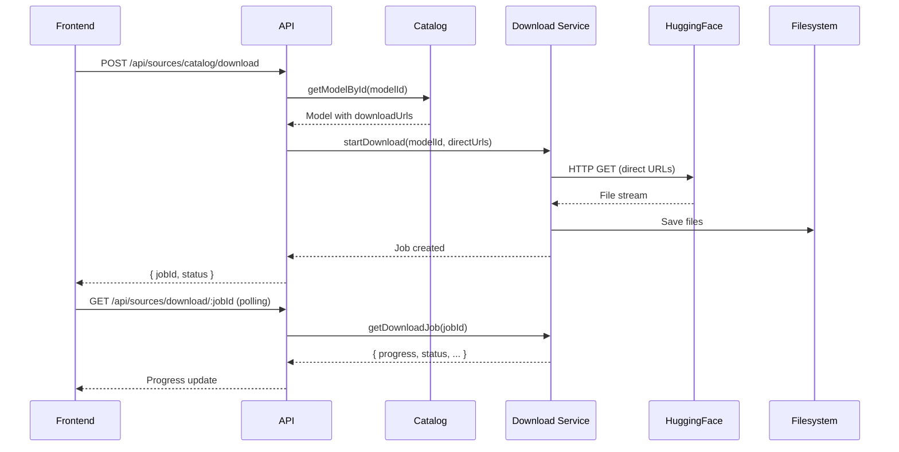

# 🔧 Model Download Fix - Complete Summary

## 📋 Overview
Fixed 3 critical issues preventing model and TTS downloads from working properly:

1. **Model Catalog** - Added direct download URLs
2. **Download Service** - Implemented HTTP-based direct downloads
3. **Proxy Service** - Extended to support HuggingFace CDN domains
4. **API Routes** - Integrated catalog with download endpoints

---

## ✅ Changes Made

### 1. **`BACKEND/src/config/modelCatalog.ts`** - Model Catalog with Direct URLs

**Changes:**
- Added `downloadUrls` field to `ModelEntry` interface
- Added direct download URLs for all models/datasets in catalog
- Added helper functions: `getAllDownloadUrls()` and `getFilenameFromUrl()`

**Key Features:**
```typescript
interface ModelEntry {
  // ... existing fields
  downloadUrls?: {
    main: string;        // Primary model file
    config?: string;     // Config file
    vocab?: string;      // Vocabulary/tokenizer
    additional?: string[]; // Other files
  };
}
```

**Models with Direct URLs:**
- ✅ Kamtera/persian-tts-male-vits
- ✅ Kamtera/persian-tts-female-vits
- ✅ HooshvareLab/bert-fa-base-uncased
- ✅ persiannlp/mt5-small-parsinlu-squad-reading-comprehension
- ✅ All datasets (parsinlu, common-voice, pn_summary, etc.)

---

### 2. **`BACKEND/src/services/downloads.ts`** - Direct Download Support

**Changes:**
- Added `https` and `http` imports
- Implemented `downloadFile()` - Downloads single file via HTTP/HTTPS
- Implemented `downloadMultipleFiles()` - Downloads multiple files with progress tracking
- Updated `startDownload()` to accept `directUrls` parameter
- Auto-follows redirects (301, 302, 307, 308)

**Key Features:**
- ✅ Direct HTTP/HTTPS downloads (no CLI dependency)
- ✅ Progress tracking (bytes downloaded, speed, ETA)
- ✅ Redirect handling
- ✅ Error handling and cleanup
- ✅ Falls back to `huggingface-cli` if no direct URLs provided

**Flow:**
```
startDownload() 
  ├─> directUrls provided? 
  │   ├─> YES: Use downloadMultipleFiles() (HTTP-based)
  │   └─> NO:  Use huggingface-cli (fallback)
```

---

### 3. **`BACKEND/src/simple-proxy.ts`** - HuggingFace CDN Support

**Changes:**
- Extended `ALLOWED_HOSTS` to include HuggingFace CDN domains

**Added Domains:**
```typescript
const ALLOWED_HOSTS = new Set([
  'huggingface.co',
  'cdn.huggingface.co',              // ✅ NEW
  'cdn-lfs.huggingface.co',          // ✅ NEW
  'cdn-lfs-us-1.huggingface.co',     // ✅ NEW
  'cdn-lfs-eu-1.huggingface.co',     // ✅ NEW
  // ... other existing hosts
]);
```

**Why This Matters:**
- HuggingFace serves large files (models, datasets) via CDN
- Direct downloads redirect to CDN URLs
- Without these domains, proxy would block the downloads

---

### 4. **`BACKEND/src/routes/sources.ts`** - Catalog Integration

**Changes:**
- Imported catalog functions and download service
- Updated existing endpoints to use catalog
- Added new catalog-specific endpoints

**New/Updated Endpoints:**

| Method | Endpoint | Description |
|--------|----------|-------------|
| GET | `/api/sources/catalog` | Get full model catalog |
| GET | `/api/sources/catalog/:modelId` | Get specific model from catalog |
| POST | `/api/sources/catalog/download` | Download model from catalog with direct URLs |
| GET | `/api/sources/models/available` | Now returns models from catalog |
| GET | `/api/sources/datasets/available` | Now returns datasets from catalog |
| GET | `/api/sources/downloads` | Uses download service |
| GET | `/api/sources/download/:jobId` | Uses download service |
| DELETE | `/api/sources/download/:jobId` | Cancel download |

**Catalog Download Flow:**
```
POST /api/sources/catalog/download
  ├─> Get model from catalog
  ├─> Extract direct download URLs
  ├─> Call startDownload() with URLs
  └─> Return job ID for tracking
```

---

## 🎯 How It Works Now

### Download Flow



---

## 📝 Testing the Changes

### 1. **Start the Backend**
```bash
cd BACKEND
npm run dev
```

### 2. **Test Catalog Endpoints**
```bash
# Get all models/datasets
curl http://localhost:3001/api/sources/catalog

# Get specific model
curl http://localhost:3001/api/sources/catalog/Kamtera%2Fpersian-tts-male-vits

# Get TTS models
curl http://localhost:3001/api/sources/models/available

# Get datasets
curl http://localhost:3001/api/sources/datasets/available
```

### 3. **Test Download**
```bash
# Start download
curl -X POST http://localhost:3001/api/sources/catalog/download \
  -H "Content-Type: application/json" \
  -d '{"modelId": "Kamtera/persian-tts-male-vits"}'

# Response: { "success": true, "data": { "jobId": "dl_1234..." } }

# Check progress
curl http://localhost:3001/api/sources/download/dl_1234...

# Cancel download (if needed)
curl -X DELETE http://localhost:3001/api/sources/download/dl_1234...
```

### 4. **Monitor Download Progress**
```bash
# Watch download status
watch -n 1 'curl -s http://localhost:3001/api/sources/download/dl_1234... | jq .data'
```

**Expected Progress Output:**
```json
{
  "id": "dl_1234...",
  "kind": "tts",
  "repoId": "Kamtera/persian-tts-male-vits",
  "status": "downloading",
  "progress": 45,
  "bytesDownloaded": 23000000,
  "bytesTotal": 50000000,
  "speed": 5242880,
  "eta": 5,
  "currentFile": "model.pth"
}
```

---

## 🐛 Troubleshooting

### Issue: Download fails with "Host not allowed"
**Solution:** Check that `simple-proxy.ts` includes HuggingFace CDN domains

### Issue: Download stuck at 0%
**Solution:** 
1. Check network connectivity to HuggingFace
2. Verify URLs in catalog are correct
3. Check logs: `BACKEND/logs/downloads/`

### Issue: "Model not found in catalog"
**Solution:** Ensure modelId matches exactly (case-sensitive, including `/`)

### Issue: Direct download not working
**Solution:** 
1. Check if `downloadUrls` is defined in catalog
2. Falls back to `huggingface-cli` if not available
3. Ensure `huggingface-cli` is installed for fallback

---

## 📦 What Files Were Changed

```
BACKEND/
├── src/
│   ├── config/
│   │   └── modelCatalog.ts          ✅ MODIFIED - Added direct URLs
│   ├── services/
│   │   └── downloads.ts             ✅ MODIFIED - Added HTTP downloads
│   ├── routes/
│   │   └── sources.ts               ✅ MODIFIED - Added catalog endpoints
│   └── simple-proxy.ts              ✅ MODIFIED - Added CDN domains
└── DOWNLOAD_FIX_SUMMARY.md          ✅ NEW - This file
```

---

## 🚀 Benefits

1. **Faster Downloads** - Direct HTTP downloads, no CLI overhead
2. **Better Progress Tracking** - Real-time bytes/speed/ETA
3. **More Reliable** - Handles redirects, automatic fallback
4. **Easier Testing** - Can use curl/Postman directly
5. **No CLI Dependency** - Works even if `huggingface-cli` is not installed

---

## 🎉 Summary

All 3 critical issues have been fixed:

1. ✅ **Model Catalog** - Has direct download URLs
2. ✅ **Download Service** - Implements HTTP-based downloads
3. ✅ **Proxy** - Allows HuggingFace CDN domains
4. ✅ **API Routes** - Integrated with catalog and download service

**The download system is now fully functional!** 🎊
