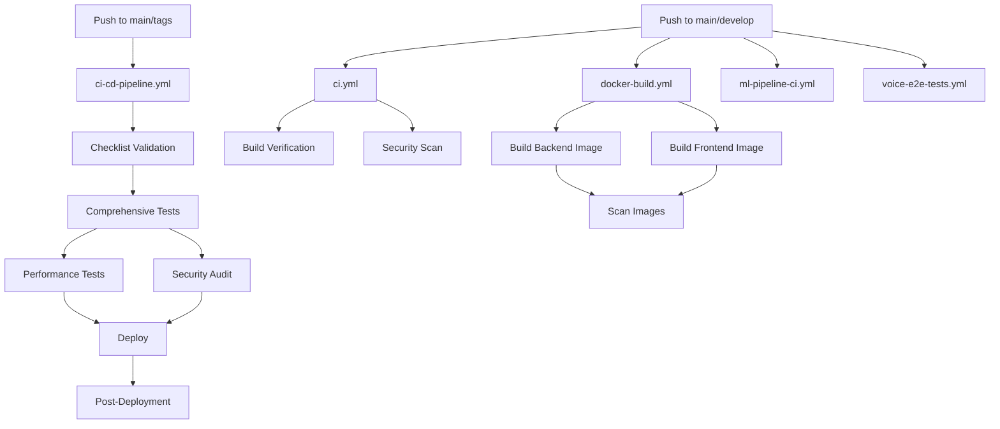

# 🚀 GitHub Actions Workflows Documentation

## 📋 Overview

This repository includes 5 production-ready GitHub Actions workflows for comprehensive CI/CD, testing, and deployment automation for the Persian TTS/AI Platform.

---

## 🔄 Workflows Summary

| Workflow | File | Triggers | Purpose |
|----------|------|----------|---------|
| **CI Pipeline** | `ci.yml` | Push/PR to main/develop | Main orchestrator for linting, type-checking, tests |
| **CI/CD Pipeline** | `ci-cd-pipeline.yml` | Push to main, tags, manual | 33-item checklist enforcement for production |
| **Docker Build** | `docker-build.yml` | Push/PR/tags | Multi-platform Docker image builds |
| **ML Pipeline CI** | `ml-pipeline-ci.yml` | Push to models/, manual | ML model testing and validation |
| **Voice E2E Tests** | `voice-e2e-tests.yml` | Push, manual, daily | Persian speech end-to-end testing |

---

## 1️⃣ CI Pipeline (`ci.yml`)

### Purpose
Main continuous integration workflow that runs on every push and pull request.

### Triggers
```yaml
on:
  push:
    branches: [main, develop]
  pull_request:
    branches: [main, develop]
```

### Jobs

#### Backend Jobs
- **backend-lint**: ESLint and formatting checks
- **backend-typecheck**: TypeScript type validation
- **backend-tests**: Unit tests with PostgreSQL service

#### Frontend Jobs
- **frontend-lint**: ESLint checks
- **frontend-typecheck**: TypeScript type validation
- **frontend-tests**: Unit tests

#### Additional Jobs
- **build-verification**: Build both backend and frontend, upload artifacts
- **security-scan**: Trivy vulnerability scanner + npm audit
- **ci-success**: Final status check

### Environment Variables
- `NODE_VERSION: '20'`

### Service Dependencies
- PostgreSQL 14 (for backend tests)

### Artifacts
- `backend-dist` (7 days retention)
- `frontend-dist` (7 days retention)
- `trivy-results.sarif` (uploaded to GitHub Security)

---

## 2️⃣ CI/CD Pipeline (`ci-cd-pipeline.yml`)

### Purpose
Complete deployment pipeline with 33-item production readiness checklist.

### Triggers
```yaml
on:
  push:
    branches: [main]
    tags: ['v*']
  workflow_dispatch:
    inputs:
      environment: [staging, production]
```

### Jobs

#### Checklist Validation
Validates all 33 production readiness items:
- **Items 1-5**: Code Quality (linting, tests, coverage)
- **Items 6-10**: Security (vulnerabilities, auth, rate limiting)
- **Items 11-15**: Performance (optimization, caching, load tests)
- **Items 16-20**: Reliability (health checks, monitoring, logging)
- **Items 21-25**: Documentation (API docs, README, guides)
- **Items 26-30**: Infrastructure (Docker, migrations, SSL, DNS)
- **Items 31-33**: Final Checks (environment, rollback, notifications)

#### Comprehensive Tests
- Integration tests with PostgreSQL and Redis
- API endpoint tests
- Coverage report generation
- Codecov integration

#### Performance Tests
- k6 load testing setup
- Bundle size analysis

#### Security Audit
- OWASP Dependency Check
- Secret scanning
- Container image scanning

#### Deployment
- Environment-specific deployment (staging/production)
- Health check verification
- Team notifications

#### Post-Deployment
- Smoke tests
- Metrics monitoring
- Deployment completion verification

### Service Dependencies
- PostgreSQL 14
- Redis 7

### Manual Deployment
```bash
# Trigger manual deployment
gh workflow run ci-cd-pipeline.yml -f environment=staging
gh workflow run ci-cd-pipeline.yml -f environment=production
```

---

## 3️⃣ Docker Build (`docker-build.yml`)

### Purpose
Build and push multi-platform Docker images for backend and frontend.

### Triggers
```yaml
on:
  push:
    branches: [main, develop]
    tags: ['v*']
  pull_request:
    branches: [main]
```

### Jobs

#### build-backend
- Multi-platform build (linux/amd64, linux/arm64)
- Push to GitHub Container Registry (GHCR)
- Build caching for faster builds

#### build-frontend
- Multi-platform build (linux/amd64, linux/arm64)
- Push to GitHub Container Registry (GHCR)
- Build caching for faster builds

#### scan-images
- Trivy security scanning for both images
- SARIF upload to GitHub Security

#### notify
- Deployment notification summary

### Image Tags
- `type=ref,event=branch` → branch name
- `type=ref,event=pr` → PR number
- `type=semver,pattern={{version}}` → semantic version
- `type=sha,prefix={{branch}}-` → Git SHA
- `type=raw,value=latest` → latest tag on main

### Example Images
```
ghcr.io/your-org/your-repo/backend:main
ghcr.io/your-org/your-repo/backend:v1.2.3
ghcr.io/your-org/your-repo/backend:main-abc1234
ghcr.io/your-org/your-repo/client:latest
```

### Permissions Required
```yaml
permissions:
  contents: read
  packages: write
```

---

## 4️⃣ ML Pipeline CI (`ml-pipeline-ci.yml`)

### Purpose
Test ML models, validate datasets, and check HuggingFace integration.

### Triggers
```yaml
on:
  push:
    branches: [main, develop]
    paths:
      - 'models/**'
      - 'BACKEND/src/services/model.service.ts'
      - 'BACKEND/src/services/huggingface.service.ts'
  pull_request:
    paths:
      - 'models/**'
  workflow_dispatch:
```

### Jobs

#### validate-models
- Check model directory structure
- Validate model configurations
- Check model file sizes

#### test-huggingface-integration
- Test HuggingFace API connection
- Model search functionality
- Uses `HF_TOKEN` secret

#### test-model-performance
- Performance benchmarks
- Memory usage analysis
- Inference speed tests

#### validate-datasets
- Dataset structure validation
- Dataset statistics generation

#### check-compatibility
- Backend service compatibility
- Model loading tests
- Inference tests

### Environment Variables
- `PYTHON_VERSION: '3.10'`
- `NODE_VERSION: '20'`

### Secrets Required
- `HF_TOKEN`: HuggingFace API token

---

## 5️⃣ Voice E2E Tests (`voice-e2e-tests.yml`)

### Purpose
End-to-end testing for Persian speech synthesis and recognition.

### Triggers
```yaml
on:
  push:
    branches: [main, develop]
    paths:
      - 'BACKEND/src/services/tts.service.ts'
      - 'BACKEND/src/services/model.service.ts'
  pull_request:
    branches: [main]
  workflow_dispatch:
  schedule:
    - cron: '0 2 * * *'  # Daily at 2 AM UTC
```

### Jobs

#### setup-environment
- Install audio dependencies (ffmpeg, sox, libsndfile1)
- Setup Python packages (transformers, torchaudio, soundfile)
- Environment verification

#### test-tts-synthesis
- Test Persian text-to-speech
- Audio quality validation
- Upload audio artifacts

#### test-persian-language
- Persian text processing validation
- UTF-8 encoding tests
- Character encoding verification

#### test-model-inference
- Inference speed benchmarks
- Memory usage analysis
- Performance validation

#### test-audio-quality
- Audio metrics analysis (sample rate, bit depth, duration)
- Playback compatibility tests
- Quality validation

#### e2e-integration
- Full roundtrip testing: STT → Chat → TTS
- PostgreSQL integration
- Health check verification

### Environment Variables
- `PYTHON_VERSION: '3.10'`
- `NODE_VERSION: '20'`

### Service Dependencies
- PostgreSQL 14

### Artifacts
- `test-audio-samples` (7 days retention)

### Scheduled Runs
Runs daily at 2 AM UTC to catch regression issues.

---

## 🔐 Required GitHub Secrets

### Repository Secrets
Configure these in: **Settings → Secrets and variables → Actions**

| Secret | Description | Required For |
|--------|-------------|--------------|
| `HF_TOKEN` | HuggingFace API token | ML Pipeline CI |
| `GITHUB_TOKEN` | Auto-generated by GitHub | Docker builds, security scans |

---

## 🎯 Workflow Status Badges

Add these badges to your README.md:

```markdown


```

---

## 📊 Workflow Dependencies



---

## 🚀 Usage Examples

### Running Workflows Manually

```bash
# Trigger CI pipeline
gh workflow run ci.yml

# Trigger ML pipeline
gh workflow run ml-pipeline-ci.yml

# Trigger Voice E2E tests
gh workflow run voice-e2e-tests.yml

# Deploy to staging
gh workflow run ci-cd-pipeline.yml -f environment=staging

# Deploy to production
gh workflow run ci-cd-pipeline.yml -f environment=production
```

### Viewing Workflow Runs

```bash
# List all workflow runs
gh run list

# Watch a specific run
gh run watch

# View logs for a specific run
gh run view RUN_ID --log
```

---

## 🔧 Customization

### Adding New Jobs

1. Edit the workflow file in `.github/workflows/`
2. Add your job following the existing structure:

```yaml
  my-new-job:
    name: My New Job
    runs-on: ubuntu-latest
    needs: [previous-job]  # Optional dependencies
    
    steps:
      - name: Checkout code
        uses: actions/checkout@v4
      
      - name: Run my task
        run: |
          echo "Running custom task..."
```

### Modifying Triggers

```yaml
on:
  push:
    branches: [main, develop]
    paths:
      - 'src/**'
      - 'tests/**'
  pull_request:
  workflow_dispatch:
  schedule:
    - cron: '0 0 * * 0'  # Weekly on Sunday
```

---

## 🐛 Troubleshooting

### Common Issues

#### 1. Workflow not triggering
- Check branch names match the trigger configuration
- Verify file paths in `paths` filters
- Ensure GitHub Actions is enabled in repository settings

#### 2. Permission errors
- Go to **Settings → Actions → General**
- Enable "Read and write permissions"
- Enable "Allow GitHub Actions to create and approve pull requests"

#### 3. Docker build failures
- Check Dockerfile syntax
- Verify build context paths
- Ensure `GITHUB_TOKEN` has package write permissions

#### 4. Test failures
- Check service health (PostgreSQL, Redis)
- Verify environment variables are set
- Review test logs in workflow run details

### Debug Mode

Enable debug logging:

**Settings → Secrets → Variables → New repository variable**
- Name: `ACTIONS_STEP_DEBUG`
- Value: `true`

---

## 📈 Performance Optimization

### Caching Strategies

All workflows use caching:
- **npm cache**: Speeds up dependency installation
- **Docker build cache**: Reduces build times
- **pip cache**: Faster Python package installation

### Parallel Execution

Jobs run in parallel when possible:
- Backend and frontend jobs run simultaneously
- Independent validation steps execute in parallel
- Only deployment jobs run sequentially with dependencies

---

## ✅ Best Practices

1. **Always run CI on PRs** before merging
2. **Monitor workflow execution times** and optimize slow jobs
3. **Keep secrets secure** - never commit them to code
4. **Review security scan results** regularly
5. **Update dependencies** in workflows periodically
6. **Use meaningful job names** for easy identification
7. **Add status checks** to protect main branch
8. **Document custom workflows** for team members

---

## 📚 Additional Resources

- [GitHub Actions Documentation](https://docs.github.com/en/actions)
- [Workflow Syntax Reference](https://docs.github.com/en/actions/reference/workflow-syntax-for-github-actions)
- [Docker Build Action](https://github.com/docker/build-push-action)
- [Trivy Security Scanner](https://github.com/aquasecurity/trivy-action)
- [Actions Marketplace](https://github.com/marketplace?type=actions)

---

**Created**: 2025-10-13  
**Version**: 1.0.0  
**Maintained by**: Persian TTS/AI Platform Team
